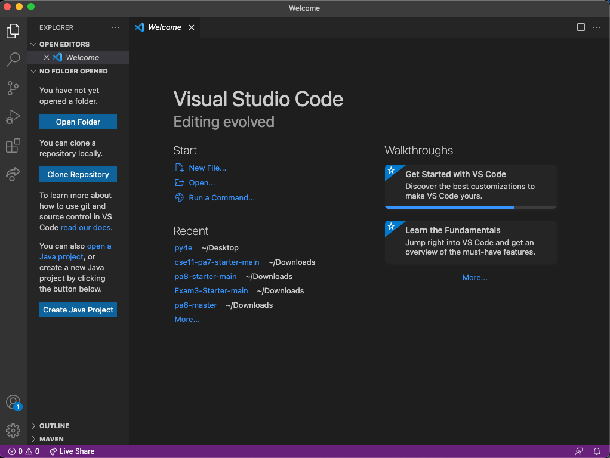

# Remote Access Using SSH
## Niklas Chang 
## *Published* January 14, 2022

## 1. Installing VScode
* First go to the website at [here](https://code.visualstudio.com/) in order to download vscode, whether you are on a Mac or Windows machine.
* After installation, the window should look like this (or with a different color theme):

## 2. Remotely Connecting
* If you are on windows, you would need to install a program called OpenSSH [here](https://docs.microsoft.com/en-us/windows-server/administration/openssh/openssh_install_firstuse)
* Find your couse-specific account at this link: [https://sdacs.ucsd.edu/~icc/index.php](https://sdacs.ucsd.edu/~icc/index.php)
* Open the terminal in VSCode, then put in the command:

`$ ssh cs15lwi22zz@ieng6.ucsd.edu`

* Type yes, and enter your password
* The whole process should look like this:

## 3. Trying Some Commands
* Here are some various commands that you can try on the terminal, either when you are connected remotely or on your *own* computer:
    * `cd ~`
    * `cd`
    * `ls -lat`
    * `ls -a`
* The picture below is an example of running some of these commands

## 4. Moving Files with scp
* A command called scp is able to copy a file/files from your computer to a remote computer. It will always run from the *client* side
* Create a simple java file, and then in the directory wehre you made the file, run the command:
`scp FileName.java cs15lwi22zz@ieng6.ucsd.edu:~/`
* It will ask for a password just like when you logged in using `ssh`. 
* After logging in with ssh, you can check to see the file in the home directory using the command `ls`
* Here is an example of running a file on the remote server:

## 5. Setting an SSH Key
* ssh keys creates a pair of files called the public key and private key. The ssh command can use the files instead of your passowrd so you don't have to keep logging in manually
* Here is an example of setting up the ssh key:

* On a Windows device, you have to follow extra `ssh-add` steps that are outlined here: [https://docs.microsoft.com/en-us/windows-server/administration/openssh/openssh_keymanagement#user-key-generation](https://docs.microsoft.com/en-us/windows-server/administration/openssh/openssh_keymanagement#user-key-generation)
* You then need to copy the *public* key to the `.ssh` directory of your user account on the server after logging in, as seen in the picture

## 6. Optimizing Remote Running
* In order to make remote running a more efficient or pleasant experience, there are certain things that you can incorporate in running code
* Writing commands in quotes at the end of an `ssh` command will directly run it on the remote server, then exit
    * For example, `$ ssh cs15lwi22@ieng6.ucsd.edu "ls"`

* Using semicolons runs multiple commands on the same line in most terminals
    * For example, `$ cp WhereAmI.java OtherMain.java; javac OtherMain.java; java WhereAmI`

Thank you so much for reading this post! I hope you find success in setting up remote access and have a great day!

-Niklas Chang