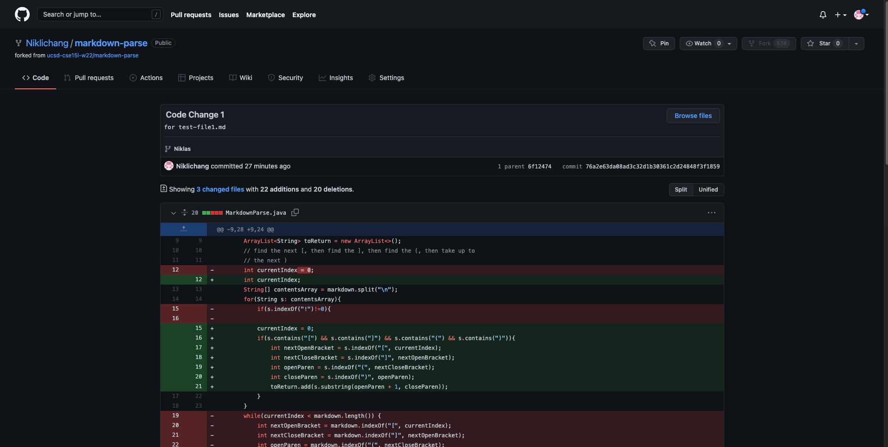
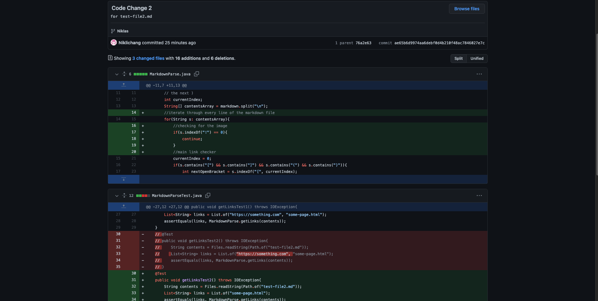
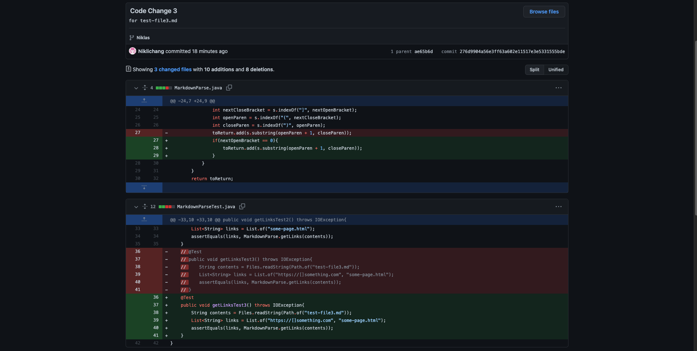

# Week 4 Lab Report
## Niklas Chang
## *Published 28 January, 2022*
## Code Change #1

[*Failure-inducing input* test file](https://github.com/Niklichang/markdown-parse/blob/276d9904a56e3ff63a602e11517e3e5331555bde/test-file1.md)

**Symptom:**

`niklaschang@Niklass-MacBook-Pro markdown-parse % java MarkdownParse test-file1.md
Exception in thread "main" java.lang.OutOfMemoryError: Java heap space
        at java.base/java.util.Arrays.copyOf(Arrays.java:3512)
        at java.base/java.util.Arrays.copyOf(Arrays.java:3481)
        at java.base/java.util.ArrayList.grow(ArrayList.java:237)
        at java.base/java.util.ArrayList.grow(ArrayList.java:244)
        at java.base/java.util.ArrayList.add(ArrayList.java:454)
        at java.base/java.util.ArrayList.add(ArrayList.java:467)
        at MarkdownParse.getLinks(MarkdownParse.java:24)
        at MarkdownParse.main(MarkdownParse.java:32)`

The bug is that when you compile it, there is an exception in the code since the code runs forever. Java goes to the failure-inducing input where it sees "i enjoy the beach" and it reaches the brackets in "[la jolla shores]", which thinks that it is part of a link. It prints an exception where it points to line 24 and 32. 
## Code Change #2

[*Failure-inducing input* test file](https://github.com/Niklichang/markdown-parse/blob/276d9904a56e3ff63a602e11517e3e5331555bde/test-file2.md)

**Symptom:**

`niklaschang@Niklass-MacBook-Pro markdown-parse % javac MarkdownParse.java
niklaschang@Niklass-MacBook-Pro markdown-parse % java MarkdownParse test-file2.md
[https://something.com, some-page.html]`

The bug does not cause an exception, but it prints out something that should not be a link. The symptom shows that `https://something.com` is a link, when in the failure-inducing input it is actually an image pointing to a "link" for the image. The bug, therefore, is that the MarkdownParse thinks an image is a link because of the similar format, except for a "!" at the beginning of the image. 
## Code Change #3

[*Failure-inducing input* test file](https://github.com/Niklichang/markdown-parse/blob/276d9904a56e3ff63a602e11517e3e5331555bde/test-file3.md)

**Symptom:**

`niklaschang@Niklass-MacBook-Pro markdown-parse % javac MarkdownParse.java
niklaschang@Niklass-MacBook-Pro markdown-parse % java MarkdownParse test-file3.md
[https://[]something.com, some-page.html, a link]`

This symptom also shows that the code works, except that it says that one of the links is literally `a link`. This is obviously not a link, but it was something that the input is testing for to see if the MarkdownParse works as intended. The bug is that MarkdownParse believes that any line with a set of brackets and parentheses is a link, so a line with these four characters would be considered a link.

Thanks again for reading this post! Have a great rest of your day!

*-Niklas Chang*