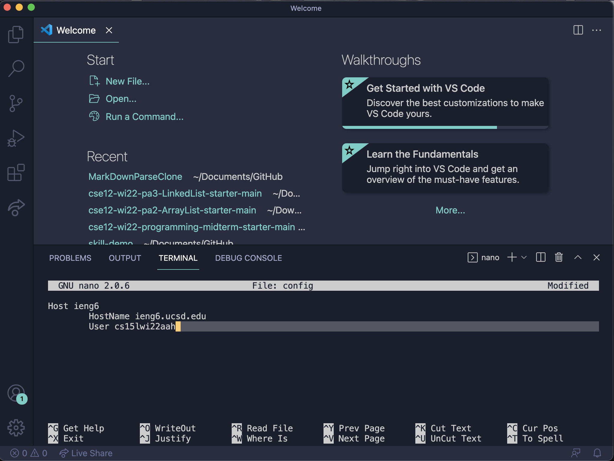
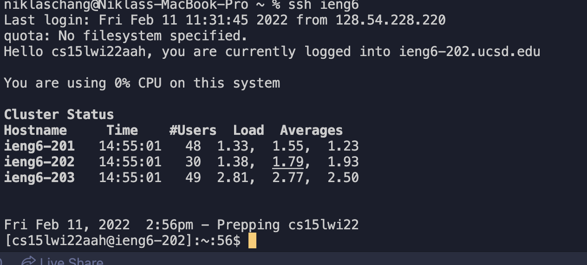
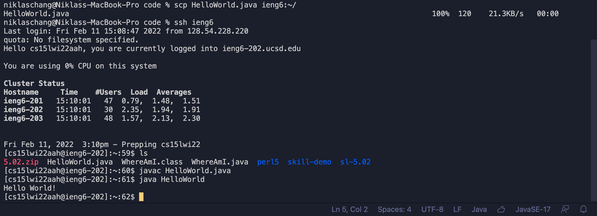

# Week 6 Lab Report
### Niklas Chang
### *Published 11 February, 2022*

[Lab Reports](index.md)

## Streamlining SSH Configuration

## SSH Config File
I first created a config file using `nano config` in the ssh file on my computer. Inside of the config file in VSCode, as shown in the picture below, I added the the lines

`Host ieng6`

`HostName ieng6.ucsd.edu`

`User cs15lwi22zzz (use your username)`

This allows you to ssh into the ieng6.ucsd.edu host with a shortcut phrase, `ieng6`.

## New SSH Command 
In the picture, I use the command `ssh ieng6`. It should use the key and log you in with the username specified using the public key. This login is definitely easier to remember and type when you need to login remotely. 

## Example Using SCP
In order to make sure everything runs smoothly, I created a HelloWorld.java file that prints "Hello World!". Then, I used the command `scp HelloWorld.java ieng6:~/`. Basically, instead of writing out the account name `cs15lwi22aah@ieng6.ucsd.edu`, I only had to write `ieng6`, which saves 22 keystrokes + trying to remember the account name.

As always, thank you for reading this post! I hope your quarter is not going as bad as mine is!

*-Niklas Chang*

