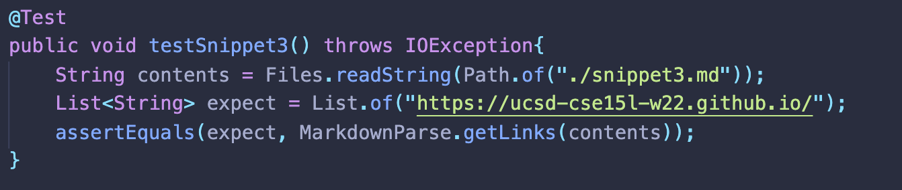

# Week 8 Lab Report 4
### Niklas Chang
### *Published 25 February, 2022*

[Lab Reports](index.md)

[Our Group Markdown-Parse Repository](https://github.com/Obarquinho/markdown-parse)
[Reviewed Markdown-Parse Repository](https://github.com/leo3friedman/markdown-parse/blob/main/MarkdownParse.java)

## Snippet 1
For Snippet 1, markdown-parse should produce ``[`google.com, google.com, ucsd.edu]``.

Code for test in `MarkdownParseTest.java`:

My implementation output when running junit test:

Reviewed implementation output when running junit test:

I think that there is a small code change that will make my program work for snippet 1 and all related cases that use inline code with backticks. The code change would probably consist of checking for a pair of backticks, and determining whether the backticks are inside a bracket or parentheses(which would still result in a link) or if a pair starts outside and ends inside a bracket or parentheses.

## Snippet 2
For Snippet 2, markdown-parse should produce `[a.com, a.com(()), example.com]`.

Code for test in `MarkdownParseTest.java`:

My implementation output when running junit test:

Reviewed implementation output when running junit test:

I think that there will be a bigger change required than just 10 lines. It would be more involved because counting many variants of parentheses and nested brackets might need a whole different approach to keeping track of all the pairs inside, and then determining which ones actually count for a link (liking using some sort of stack implementation).

## Snippet 3
For Snippet 3, markdown-parse should produce `https://ucsd-cse15l-w22.github.io/`.

Code for test in `MarkdownParseTest.java`:

My implementation output when running junit test:

Reviewed implementation output when running junit test:

This one will also be a bigger change. The whole point of the code at the moment relies on how it checks for a link on a certain line depending on the open and close parentheses and brackets. When introduced to multiple lines, it becomes a lot more complicated.

Thank you again for reading this post! If you are grading and start an issue on github, put a :) at the end. 

:)
*-Niklas Chang*