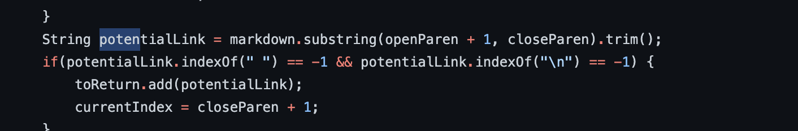

# Week 10 Lab Report 5
### Niklas Chang
### *Published 11 March, 2022*

[Lab Reports](index.md)

In order to find the tests with different results, I basically searched through the results.txt manually using `cat results.txt`. "cat" views the contents of the file. I then went through the files and found ones that were different in the results.txt from the lab, and from our group markdown-parse.

## Test 194
Lab Result:

Own Result:

Both these implementations are incorrect. Running the file through [commonmark](https://spec.commonmark.org/dingus/), the expected output is this:

The problem with the code is that when it adds a link to the toReturn using potentialLink, it takes a substring based off of the open and close parentheses, which is not the case in this markdown file. (shown in the picture below)

## Test 201
Lab Result:

Own Result:

The lab's version of markdown-parse is incorrect. There is no link in the file. Running the file through [commonmark](https://spec.commonmark.org/dingus/), the expected output is this:

The problem with the the code is that it does not check if there is a space in between the close bracket and the open parentheses. And if there is a space, then it will not be recognizes as an actual link, while the implementation does. (shown below)

Thank you for reading the last post. The quarter has gone by so fast, and I hope you have a great break!

;(

*-Niklas Chang*